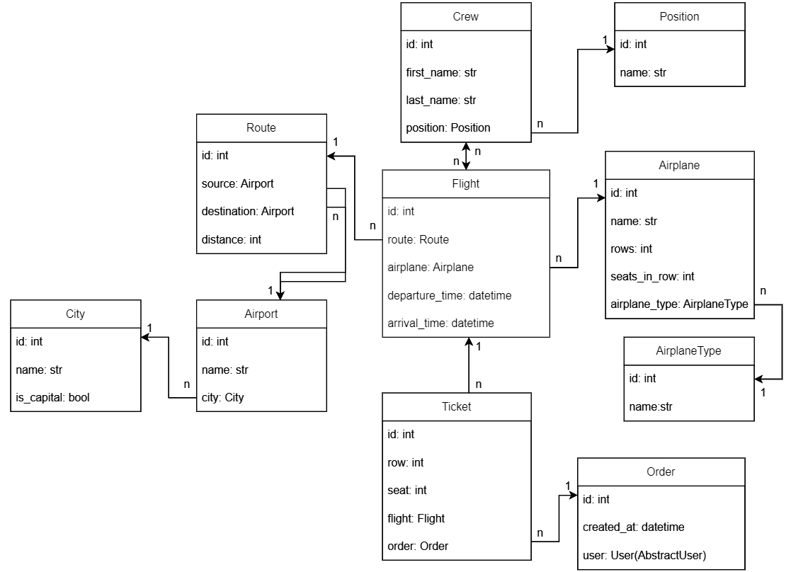
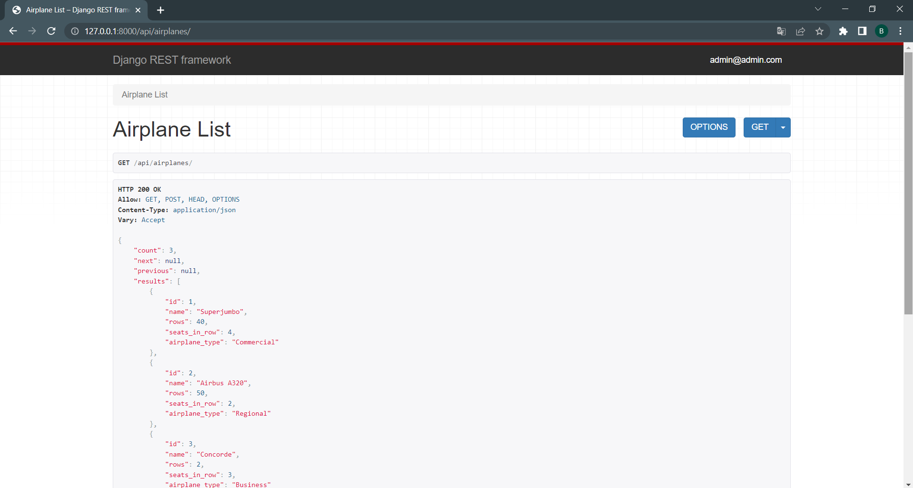
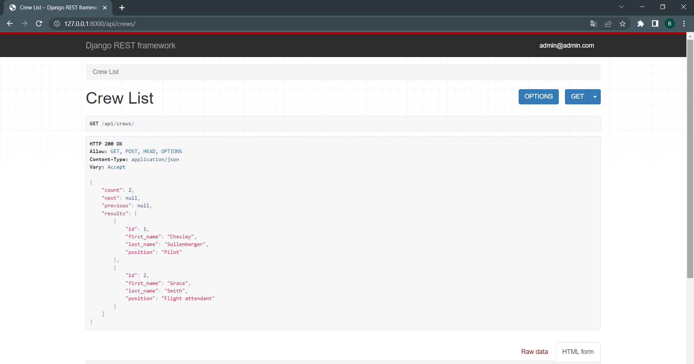
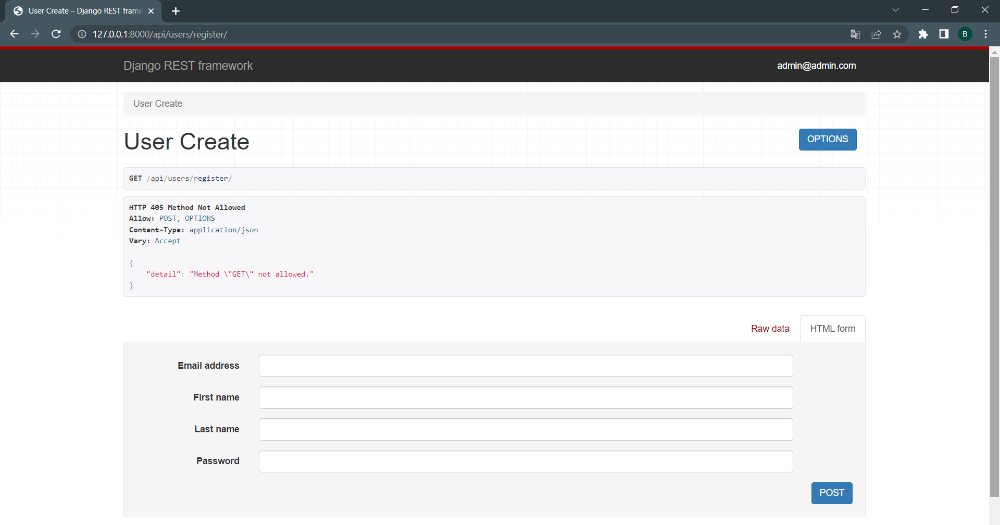
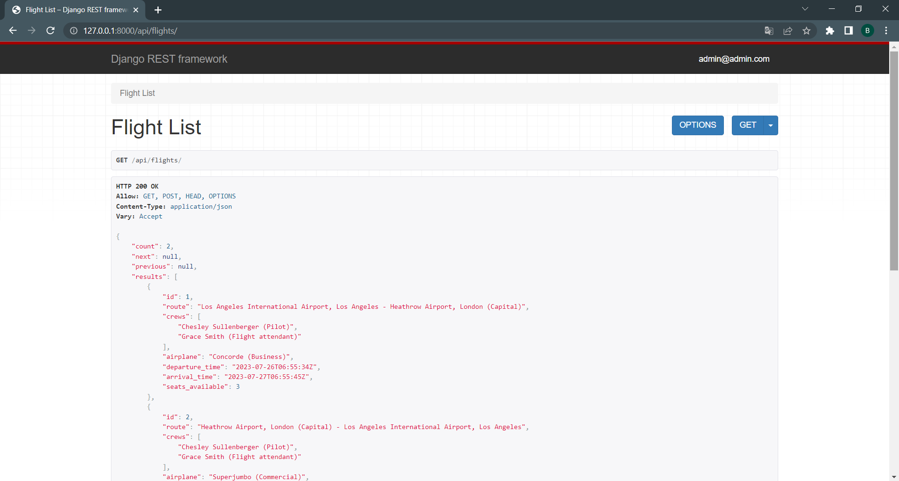
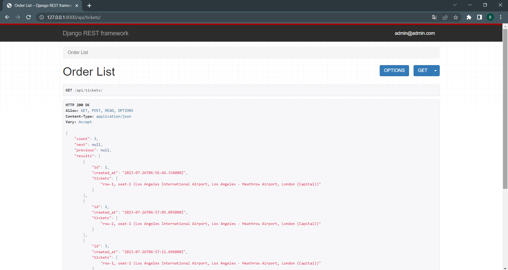
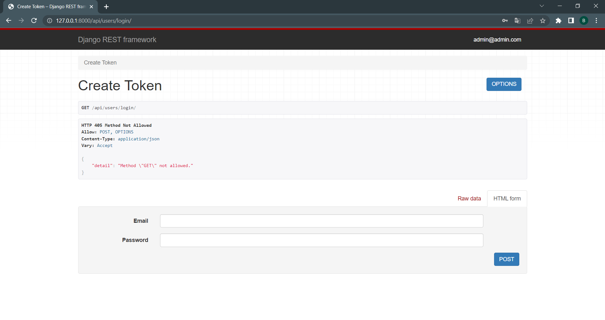
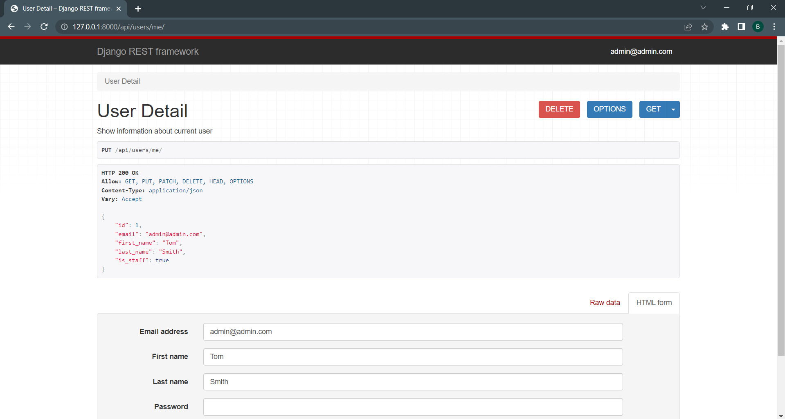
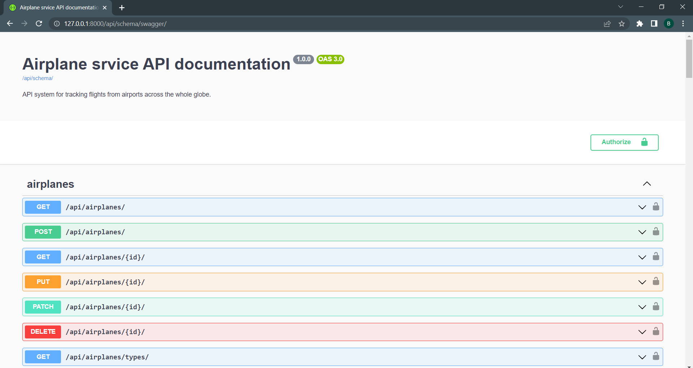

# Airport-API-Service 

Welcome to the Airport Service API! This API provides a comprehensive solution for managing flight orders and flight details, catering to both users and administrators. Whether you're a developer integrating flight booking functionality into your application or an airline company seeking an efficient system to handle reservations and flights, the Airport Service API has got you covered.

___

## DB structure



## Features

* ___Flight Order Creation___: Users can easily create flight orders (tickets) for their desired flights. The API allows users to specify their details, such as passenger seat and row, when creating an order.
* ___Flight Management___: Administrators can add new flights to the system and manage existing ones. The API allows administrators to update flight details, delete flights, and retrieve a list of all flights in the system.
* ___Authentication and Permissions___: The API is secured with token-based authentication using the Django Rest Framework (DRF). Users need to authenticate with a token to create orders, and administrators have exclusive access to flight management actions.
* ___Filtering and Pagination___: The API supports filtering of flight orders based on the source and destination airports. Also filtering is available with every endpoint. Additionally, pagination is implemented to efficiently manage large sets of data.
* ___API Documentation___: The API documentation is automatically generated using DRF Spectacular. It provides a clear overview of available endpoints, request parameters, response formats, and authentication requirements. Filtering is also mentioned in documentation
* ___User-Centric Order Retrieval___: Users can only view and manage their own orders. The API enforces this restriction, ensuring privacy and security.
___

## Prerequisites
Before you dive into the setup process, ensure you have the following prerequisites installed on your system:

* ___Docker___: Docker is used to containerize the application, making it easy to deploy and run consistently across different environments. You can download and install Docker from the official website: https://www.docker.com/.

## Getting Started

To set up the Airport Service API, follow these steps:

1. Clone the repository:
    ```
    git clone https://github.com/VTeteruk/Airport-API-Service.git
    ```
2. Navigate to Project Directory: Change into the project directory using the following command:
    ```
    cd airport-service-api
    ```
3. Build and Run Docker Container: Use Docker Compose to build the API's Docker container and start the API server:
    ```
    docker-compose up --build
    ```

## How to use

You need to log in by this endpoint: ``localhost:8000/api/users/login``

If you want to try admin side you may use:
- login: ``admin@admin.com``
- password: ``123456``

If you want to try user side you may use:
- login: ``user@user.com``
- password: ``123456``
___

## Conclusion

Thank you for using the Airport Service API! We hope it serves as a reliable and efficient solution for your flight booking needs. Happy flying! 🛫

## Screenshots









